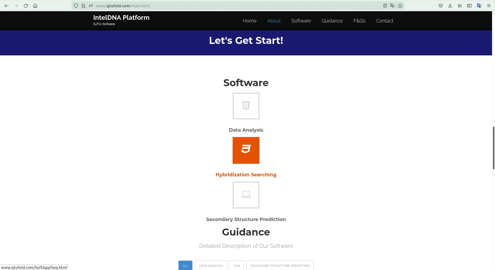

# GUIDANCE

<<<<<<< HEAD
You can visit our website through www.sjtufold.com
=======
http://www.sjtufold.com/

The function of our website can be divided into three components. 
>>>>>>> 7178a3f78bbfec918890803b2e51a27f77d2f657

Click `GET START` to explore more function

The function of our website can be divided into **3** components. 

The first function is to ==predict the secondary structures of specified RNA sequences==.

You just need to input a RNA sequence(composed of ATCGU or atcgu). Then click the SUBMIT button. The software will return a web interface for displaying RNA secondary structures, you can even drag the specified bases you want to observe their structural changes. The website also provides an example for display. Tap EXAMPLE button and click the SUBMIT button below. You will see the most accurate prediction of RNA secondary structure. If the sequence you entered contains bases other than ATCGU (atcgu), you will receive an error message.

________

______

The second function of our website is to ==evaluate whether the probe designed by the user will hybridize with other nucleic acid substance sequences in a specific biological environment and assign a score based on the hybrid situation==

User first enters target sequences (mostly are the probes you've designed), and then enters the sequence of other nucleic acid substances in the environment, each sequence is separated by a BLANK. Don’t forget to enter the total number of sequences in the input box above (the number of target sequences plus the number of other sequences).Remember the sequences entered should also be composed of ATCGU(atcgu).

We will soon return a score, and you can use the score to judge whether the probe you designed can function well in the specific biological environment without being too disturbed by the other sequences. A score less than 50 indicates that the probe is working well. The higher the score is, the more the probe is disturbed by the environment and the more serious the hybridization is. You can also click on EXAMPLE button to view the demonstration. If the number you entered is inconsistent with the number of sequences you entered, you will also receive an error message.

________

_______

The website also provides ==data analysis function based on differential expression analysis and SVM model==

First you need to upload a healthy person data file and a patient data file separately. Then click the SUBMIT bottom. The results include the names of the selected biomarkers such as miRNA and their corresponding weight parameters in the SVM model. The format of the uploaded file can be txt or csv. The size must be less than ==10M==. The data format in the file is similar with the dataframe in pandas. In the Dataset part of the website, we provide corresponding examples for reference. The running time of the program depends on the size and complexity of the data in the uploaded file, so please be patient when using it. 

Our website has strong user-friendliness. If the uploaded data cannot be analyzed, we will clearly output corresponding prompts so that you can find more suitable data. If you do not have data for analysis but you need to conduct related disease research, our website provides a database containing multiple data samples of 3 types of cancer. You can visit the DATA SET part and select the disease to download,using our data analysis function to screen for biomarkers. All our data comes from public data sets, which you can use for scientific research and academics. If it is used for business, please contact us. 

